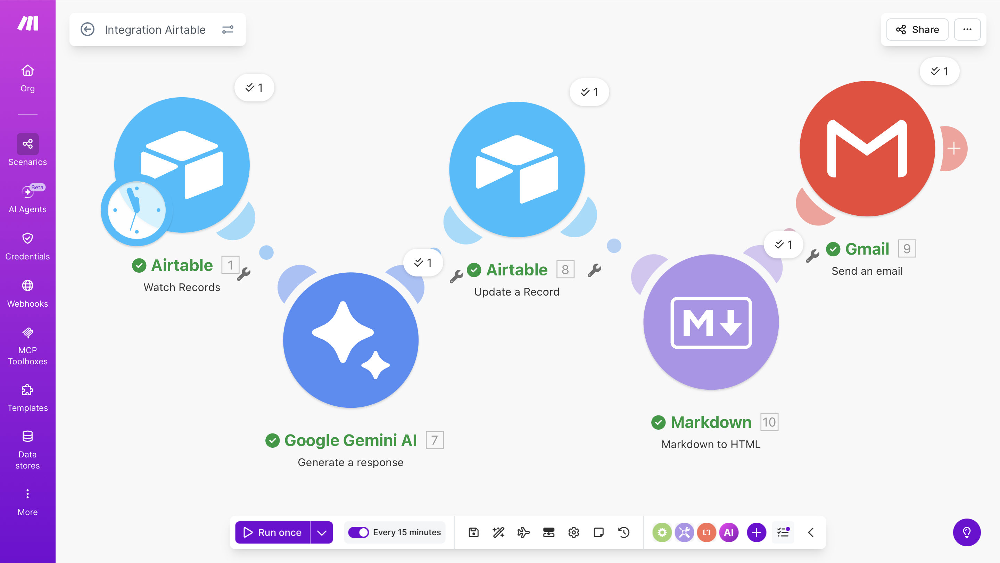

# AI-Recruitment-Engine
A production-grade, multimodal AI resume screening pipeline built with Gemini 1.5 Flash, Airtable, and Make.com. Automates PDF parsing, candidate scoring, and personalized email orchestration.
---

## 📸 Project Gallery

### 1. Automation Architecture (Make.com)

### 2. HR Intelligence Hub (Airtable)

### 3. Automated Outreach Result (Gmail)

